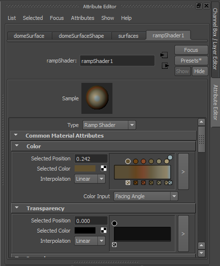
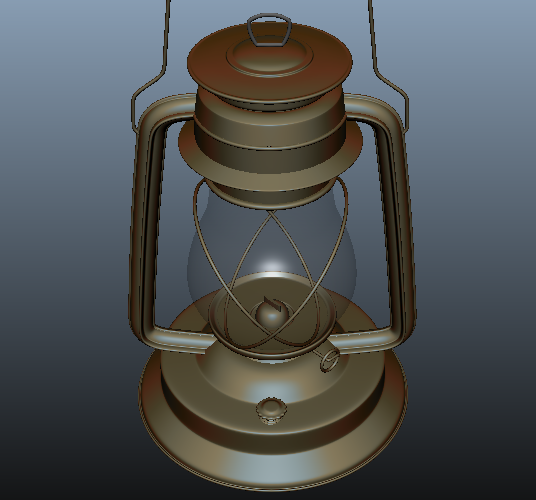
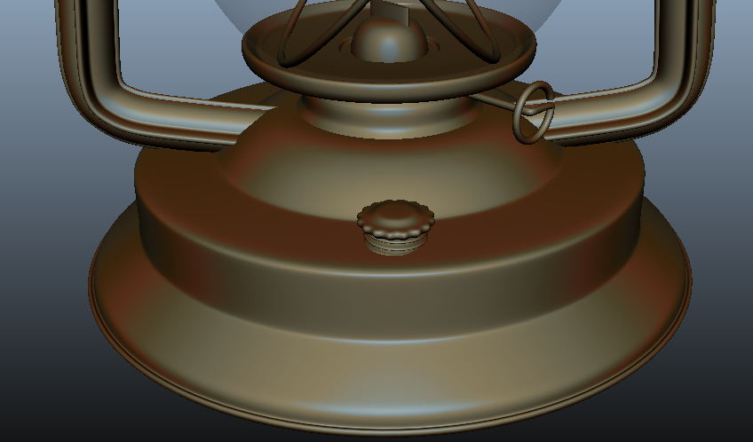
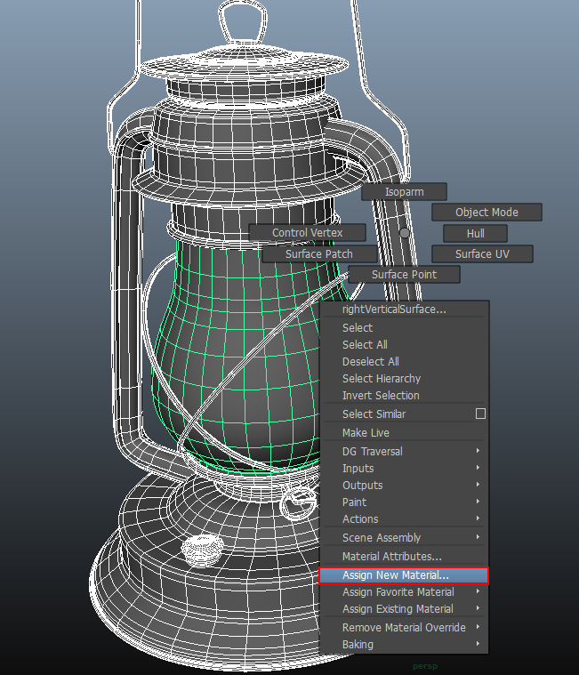
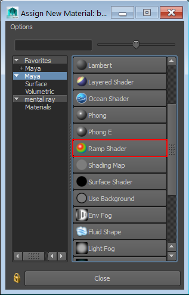
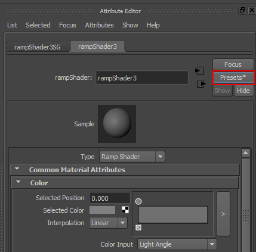
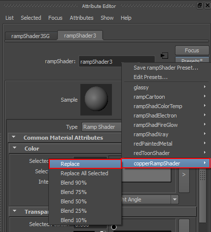
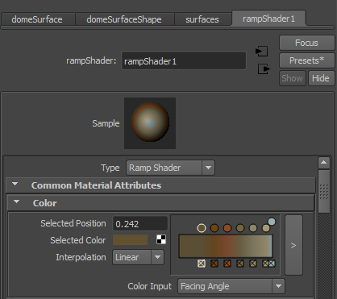
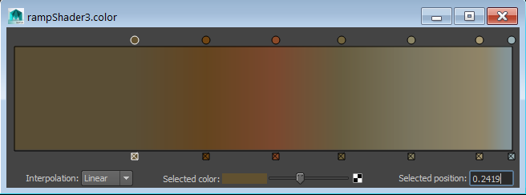

# Copper Ramp Shader Material for Maya #
-------------------------
2015-01-15

Created by Andrew Hazelden  
Email: [andrewhazelden@gmail.com](mailto:andrewhazelden@gmail.com)  
Web: [www.andrewhazelden.com](http://www.andrewhazelden.com)  

## Overview ##

If you've ever used a sculpting program like Z-brush or Mudbox you've probably fallen in love with their real-time material shaders that create a very stylistic look. I've prepared a new Maya ramp shader material preset called the "copper ramp shader" that allows you to create a similar look in Maya using a multi-colored gradient ramp and a facing angle style of surface shading.

## Screenshots ##

Here is a snapshot view of the Maya attribute editor window with the "copperRampShader" preset applied:
  
  

In this screenshot I've taken a hard surface model of a storm lantern that is from the [Dover Studios](http://www.doverstudios.com/) Maya NURBS Modeling training video and applied the copperRampShader material:

  
  

## Attribute Preset Installation ##

You can install this Maya preset by copying the copperRampShader.mel file to one of the following Maya attribute presets folders. You will probably have to create the folder named "rampShader" in your attrPresets directory, too.

**Windows:**

`C:\Users\<User Account>\Documents\maya\<Maya Version>-x64\presets\attrPresets\rampShader`

**Mac:**

`~/Library/Preferences/Autodesk/maya/<Maya Version>-x64/presets/attrPresets/rampShader`

**Linux:**

`~/maya/<Maya Version>-x64/presets/attrPresets/rampShader`

The next time you start Maya the new CopperRampShader attribute preset will be available.

## Applying the Copper Ramp Shader ##

**Step 1.** Select your object in the perspective view and use your right mouse button to open the marking menus. Then click on the the "Assign New Material..." item.

In the Assign New Material window click on the "ramp Shader" material.

**Step 2.** In the attribute editor window, switch to the ramp shader tab and select the "Presets" button in the attribute editor window.

**Step 3.** Navigate down to the "copperRampShader" item and select the replace option. 

You should now see the custom settings applied to the ramp shader and the viewport should show the updated surface material.

## Tweaking the Colors ##

If you are interested in changing the placement or saturation of any of the ramp colors in the Attribute Editor, click on the arrow button in the Color attribute section to open up the "rampShader.color" editor window.

Dragging the circular control handles will move the placement of the colors. Clicking on the color swatch by the Selected Color attribute will allow you to open up a color picker window to change an individual color on the ramp.

